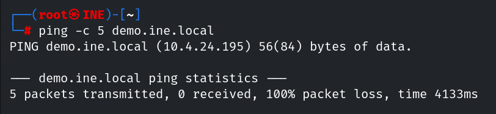
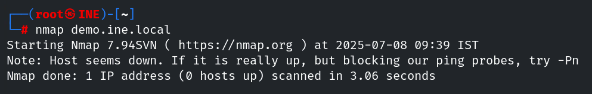
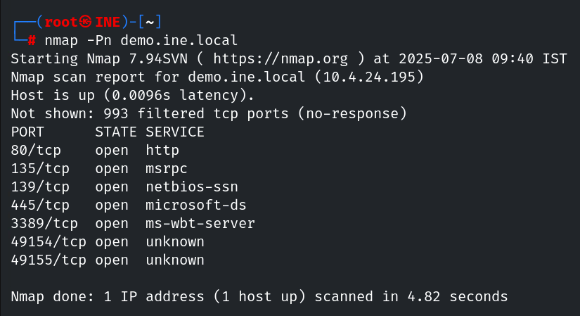
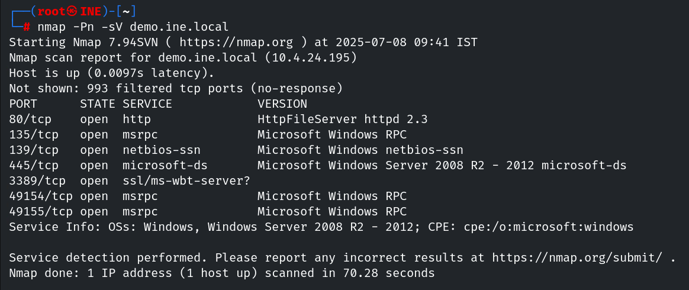

# INE Lab - Host Discovery & Service Enumeration with Nmap

## Objective
Identify active hosts and running services on `demo.ine.local` network, simulating an ICMP-blocked environment.

## Methodology

### 1. Initial Ping Test
```bash
ping -c 5 demo.ine.local
```
- **Results**: 
  - No host response (ICMP blocking detected).
  -   
  *Figure 1: Ping test failure due to ICMP filtering*

### 2. Basic Nmap Scan
```bash
nmap demo.ine.local
```
- **Results**: 
  - False negative (without `-Pn` flag).
  - 
  *Figure 2: Scan without -Pn still shows host offline*

### 3. Host Status-Ignorant Scan (`-Pn`)
```bash
nmap -Pn demo.ine.local
```
- **Results**: 
  - 7 open ports (80/HTTP, 135/msrpc, 139/netbios-ssn, 445/micrsoft-ds, 3389/ms-wbt-server, 49154/unknown e 49155/unknown).
  -   
  *Figure 3: -Pn scan revealing open ports*

### 4. Service Version Detection (`-sV`)
```bash
nmap -Pn -sV demo.ine.local
```
- **Results**: 
  - Identified services:
    - 80 / HttpFileServer httpd 2.3
    - 135 / Microsoft Windows RPC
    - 139 / Microsoft Windows netbios-sn
    - 445 / Microsoft Windows Server 2008 R2 - 2012 microsoft-ds
    - 49154 / Microsoft Windows RPC
    - 49155 / Microsoft Windows RPC
      Operacional System: Windows Server 2008 R2 - 2012
  -   
  *Figure 4: Service versions detected*

## Key Findings
- ICMP blocking doesn't indicate host inactivity. Nmap's `-Pn` flag bypasses this limitation.
- Service enumeration (`-sV`) revealed vulnerable software versions (Http File Server 2.3 - CVE-2014-6287 Detail).

## Useful Commands
```bash
# Quick scan for ICMP-restricted networks
nmap -Pn --top-ports 100 192.168.1.1

# Aggressive service detection
nmap -Pn -sV -sC -O demo.ine.local
```

## References
- [Nmap Official Documentation](https://nmap.org/book/man.html)
- [NIST - CVE-2014-6287 Detail](https://nvd.nist.gov/vuln/detail/CVE-2014-6287)

---  
`[](https://nmap.org)`
